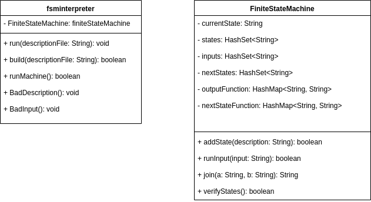
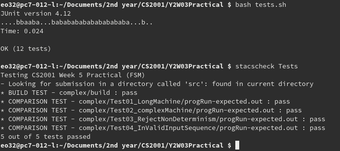
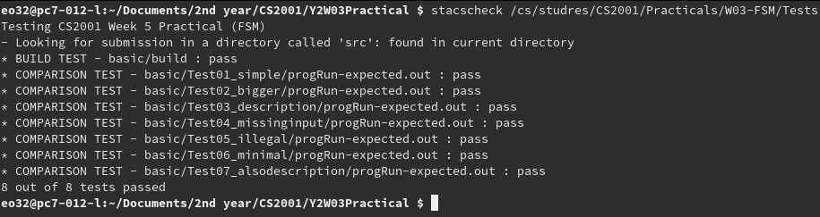

# W03 Practical Report

## Overview

The practical asks that a program which can read a description of a Finite state machine as a transition table and a sequence of input characters. Then interprets the description finite state machine into a program which runs on the sequence of strings inputted. If the description is not well formed then the program will print “Bad description” and exit without interpreting input. If the input is not in the set of accepted symbols (Input set) it should print “Bad input” and exit.

### Assumptions and Intuitions 

Assumptions and intuitions extrapolated from specification made while designing the program:

* That the name of states can be a single ASCII character long as they are unique (Same naming convention for Inputs and outputs). So a general regex pattern of

```regex
[\\s]*.[\\s]+.[\\s]+.[\\s]+.[\\s]*
```

can be used to denote them factoring in for variation in white pace.

* If a string input characters are not present in the set of valid input the it is a bad input.
* If next state function returns state that is not in the valid set of states then it is Bad Description.
* Each state much accept (e.g. have a corresponding next State and output) for each
* The first line is assumed to be the first state.
* Assume that non-determinism is Bad description and will not be implemented by the program. e.g. this program is a Deterministic Finite Machine interpreter.

## Design



### `fsminterpreter`

This class was design to be an interface between the user and the finite state machine. This is where the input shall be gathered from the user and the file processing to obtain the string data will be made. It was designed with the intent to abstract all the functionality of the finite state machine into another place where it can be effectively tested. So in this classes basic processes could be factored for.

### `FiniteStateMachine`

It was decided that this class would represent the all aspects of the finite state machines mathematical description $F = \{S, \sigma, I, O, f, g\}$. This allowed for all aspects of the machine to be stored by data structures that could be manipulated by the program. As it was found to be an easy way to explain the functionality of the system, it was ideal for showing the functionality of different aspects of machine.

Using $S$ it can be checked from the transition table that next state function ($f$) does not return values which are not in the set. Making easy to reject bad descriptions.

The initial state state is only recorded in the reading of first line from the state description. In this class the $\sigma$ was changed to denote just current state and it’s initial value would be the initial state. So the that the state the program was currently at would be easily determined.

When a input was entered into the machine it is checked if it is contained in the set $I$. This made validation of input very easy as it could checked in 1 line.

The set outputs was not required $O$ as $g$ the output function and even the $f$ the next state function were modelled as hash maps. Hash maps model real mathematical functions as hash maps correlate and input to 1 and exactly 1 output. The key for the hash map was chosen to be the concatenation of the state and the input as this would uniquely identify the next state and output given state is represented. The $f$ and $g$ functions could have been merged into 1 hash map, but this further deviates from the mathematical model of the finite state machine hoping to be achieved and makes retrieval process and insertion process more difficult as an object or collection is required to store both data for the output and the next state.

This classes is also responsible for determining the validity of the state definitions provided to the program. As in checking each state has output and a next state for each input and for check that each state in that is range of values of next state function has definition. etc

## Testing

To determine if full functionality was achieved by program 2 methods of testing were invoked.

1. `Junit` tests which tested the modular functionality of the program.

   To run the tests.

   ```bash
   bash test.sh
   ```

   

| Test                              | Description                                                  |
| --------------------------------- | ------------------------------------------------------------ |
| `emptyStateDescription`           | Tests that the program rejects empty input                   |
| `validStateSingleWord`            | Tests string which do not follow pattern are rejected        |
| `validStatesEvenlySpacedWord`     | Tests that string which do not follow the pattern of regex defined are rejected. |
| `validStateDescription`           | Tests given valid input the program accepts it.              |
| `validStateDescriptionOddSpacing` | Tests the program will accepts valid description even with odd and irregular spacing. |
| `NonDeterminism`                  | Tests the program rejects non-determinism                    |
| `allInputsAccepted`               | Tests that each state accepts all valid inputs               |
| `validInputAccepted`              | Tests the program accepts valid input given a valid description. |
| `invalidInputReject`              | Tests the program rejects input which is not in the valid state of inputs. |
| `validSequence`                   | Tests if the finite state machine maintains consistence in acceptance of valid input given a long sequence of input. |
| `invalidTest`                     | Tests invalid sequence for finite state machine. Sees if the program is able to detect invalid input in a long sequence of input. |

2. `statcscheck` tests were used to test the program from the perspective of a user of the system.

   

| Test                          | Description                                                  |
| ----------------------------- | ------------------------------------------------------------ |
| `Test01_LongMachine`          | Checks machine continuous functions for longer series of outputs than previously provided. |
| `Test02_complexMachine`       | Runs a finite state machine with more states and inputs than previously tested and checks for full functionality |
| `Test03_RejectNonDeterminism` | Checks that non-deterministic finite state machines are rejected by program |
| `Test04_InValidInputSequence` | Checks the program is able to detect invalid input in a longer series of input than previously tested. |

#### Testing Output



#### Prescribed Stacscheck Output



## Conclusion

Through testing it can be seen that the program does fulfil the denoted requirements which were specified. Therefore it can be assumed that a program which can interpret a finite state machine given a description can be made.

### Given more time

Give more time to develop this practical, determining if certain states of the machine are unreachable could have been developed. Though it was not required explicitly in the specification whether this is a bad description, a finite state machine which's description contains states which are unreachable could be detected.

```text
1 a a 2
2 a b 1
3 a c 3
```

Here it can be seen the the state 3 is unreachable.

Also some method to process and execute non-deterministic finite state machines could have been developed.